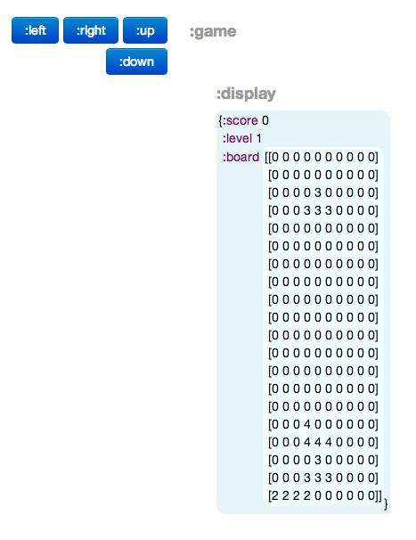

# Rouge 

It's that falling block game, but with [Pedestal](http://pedestal.io) and [core.async](http://github.com/clojure/core.async)!

## Play it!

1. Launch a REPL (in rouge) with `lein repl`
2. `(start)`
3. Visit <http://localhost:3000/rouge-data-ui.html>
4. Win!

Right now the game is completely rendered in Pedestal's Data UI, but that's pretty much the coolest thing ever. Enjoy!

## TODOs

* More tests
    * Any hold-overs from [console](https://github.com/rkneufeld/rouge/tree/console).
    * Figuring out how to work with the game "loop" (core.async timeout channels) in test
         * Idea: `with-redefs` the timeout channel generating function to control this.
         * Follow up: fix timing issues in tests.
    * In general, just more tests.
* Tight graphics (custom renderer)
* Keyboard input
* Speed up the game with higher level
* Sweet wall kicks
* Music and sound

## Other stuff

I based this Pedestal version of that falling block game on a console version I
wrote. You'll find that version at
<https://github.com/rkneufeld/rouge/tree/console>.

## License

Copyright (C) 2013 Ryan Neufeld

Permission is hereby granted, free of charge, to any person obtaining a copy of this software and associated documentation files (the "Software"), to deal in the Software without restriction, including without limitation the rights to use, copy, modify, merge, publish, distribute, sublicense, and/or sell copies of the Software, and to permit persons to whom the Software is furnished to do so, subject to the following conditions:

The above copyright notice and this permission notice shall be included in all copies or substantial portions of the Software.

THE SOFTWARE IS PROVIDED "AS IS", WITHOUT WARRANTY OF ANY KIND, EXPRESS OR IMPLIED, INCLUDING BUT NOT LIMITED TO THE WARRANTIES OF MERCHANTABILITY, FITNESS FOR A PARTICULAR PURPOSE AND NONINFRINGEMENT. IN NO EVENT SHALL THE AUTHORS OR COPYRIGHT HOLDERS BE LIABLE FOR ANY CLAIM, DAMAGES OR OTHER LIABILITY, WHETHER IN AN ACTION OF CONTRACT, TORT OR OTHERWISE, ARISING FROM, OUT OF OR IN CONNECTION WITH THE SOFTWARE OR THE USE OR OTHER DEALINGS IN THE SOFTWARE
